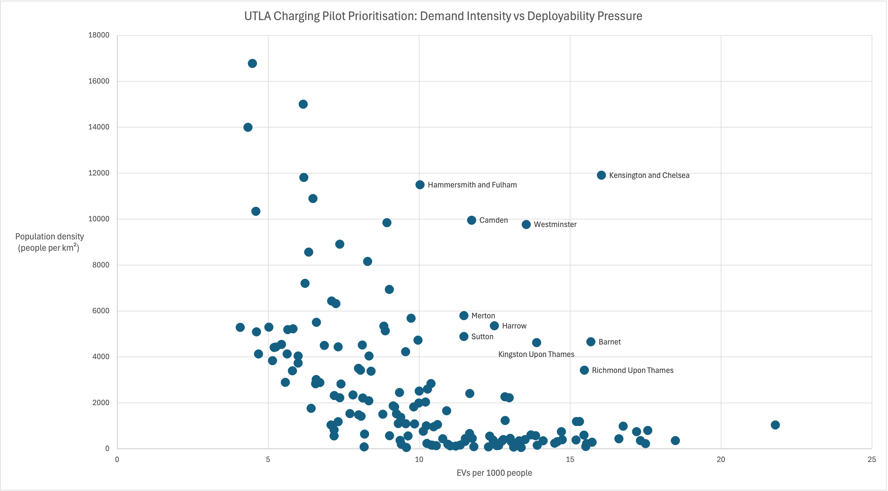

# Data-Driven Prioritisation of UK EV Charging Pilot Markets

*A data-driven framework for prioritising UK EV charging pilot markets using publicly available datasets.*

---

## Overview

This project explores how an early-stage EV charging startup might prioritise UK local authorities for pilot deployments of public charging infrastructure.

It frames the problem as a **strategy and operations decision under real-world constraints**, using publicly available data to support transparent, defensible recommendations.

The analysis focuses on **near-term pilots (12–18 months)**, where capital, delivery capacity, and political feasibility are limiting factors.

---

## Project write-up

- [Executive brief](docs/executive_brief.md)
- [Strategy memo](docs/strategy_memo.md)

Final output dataset: `data/processed/utla_pilot_ranking.csv`

---

## Decision question

**Which UK local authorities should be prioritised for EV charging pilot deployments, given demand pressure and deployability constraints?**

---

## Analytical approach

Local authorities are assessed across two core dimensions:

### 1. Demand intensity

- EV adoption levels
- EVs per 1,000 residents

### 2. Deployability constraints

- Population density (people per km²), used as a proxy for limited private parking and greater reliance on public charging infrastructure

These metrics are aggregated to **Upper Tier Local Authority (UTLA)** level and combined into a transparent prioritisation score.

The emphasis is on **decision support**, not predictive modelling or technical optimisation.

---

## Data sources

This project uses publicly available UK datasets, including:

- ONS local authority lookup and population estimates
- DVLA electric vehicle registrations by local authority
- ONS Standard Area Measurements (land area)

Raw data is **not included** in this repository. Sources, snapshot dates, and download links are documented separately.

---

## Geography and administrative units

### Unit of analysis: Upper Tier Local Authorities (UTLAs)

This project aggregates data to **Upper Tier Local Authority (UTLA)** level, which is the relevant geography for transport and infrastructure responsibilities in England.

UTLAs include:

- County councils
- Metropolitan boroughs
- London boroughs
- Unitary authorities

As of 2025, there are **153 UTLAs in England**.

---

### LAD → UTLA aggregation

Several source datasets are provided at **Lower Tier Local Authority (LAD)** level. These are aggregated to UTLAs using an official LAD–UTLA lookup table.

Important implications:

- County UTLAs (e.g. Kent, Essex) aggregate multiple LADs
- Unitary authorities and metropolitan boroughs typically map 1:1
- LAD counts per UTLA therefore vary substantially

This explains why some UTLAs appear multiple times in intermediate tables prior to aggregation.

---

### Known caveats

- Boundary changes and reclassifications mean historical datasets may not align perfectly with current UTLA definitions
- Population totals are derived by summing LAD populations and may differ slightly from published UTLA headline figures
- All analysis assumes **static 2025 UTLA boundaries**
- Two UTLAs are absent from the final analytical dataset due to missing population data in the source LAD-level population dataset used for aggregation. As a result, the final ranking includes **151 UTLAs** rather than the full set of 153.

These assumptions are reasonable for **comparative prioritisation**, but results should not be interpreted as official statistics.

---

## Methodology

1. Clean and standardise datasets at local authority level using SQL
2. Aggregate LAD-level data to UTLA geography
3. Construct interpretable demand and deployability metrics
4. Combine metrics into a transparent scoring framework
5. Rank local authorities for pilot deployment suitability
6. Stress-test results using alternative weighting assumptions

---

## Key output



The primary analytical output is a ranked list of **UK Upper Tier Local Authorities (UTLAs)** for EV charging pilot deployment.

The ranking is based on:

- EV adoption intensity (`evs_per_1000_people`)
- Population density (`population_density_per_km2`)
- Composite pilot scores (`pilot_score_equal` and `pilot_score_density_weighted`)

---

## Reproducing the analysis

1. Download the raw datasets listed in the **Data sources** section.
2. Import them into a SQLite database (e.g. using **DB Browser for SQLite**).
3. Run the SQL scripts in the `sql/` folder in numerical order.
4. Review the final ranking in the `utla_pilot_ranking` view.

---

## Repository structure

```text
ev-charging-prioritisation/

README.md

sql/        # SQL pipeline for cleaning, aggregation, and ranking
docs/       # Executive brief and strategy memo

data/
  raw/      # Raw datasets (not tracked in repository)
  processed/ # Final analytical outputs
```

---

## Notes

This project is designed to mirror how strategy and operations analyses are conducted in early-stage technology companies, particularly in regulated and infrastructure-heavy sectors.

## Status

Completed analytical prototype. Further extensions could incorporate housing stock or parking data to refine deployability estimates.